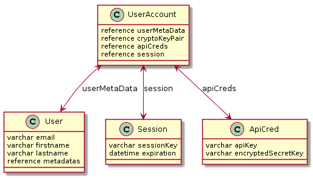

Table of Contents

1. [User Models](#user-models)
   + [Entity Relationship Diagram](#user-models-relationship-diagram)
   + [UserAccount](#useraccount)
   + [User](#user)
   + [ApiCred](#apiCred)

#User Models

##User Models Relationship Diagram

## UserAccount

The parent model for all user-related information

#### Properties

1. userMetadata
   * Reference to User table
   * Required field
1. apiCreds
   * Reference to ApiCred table
   * Required field

## User

The model that stores the metadata related to a user's account

#### Properties

1. email
   * varchar (length: 50)
   * Unique constraint
   * Required field
1. firstname
   * varchar (length: 20)
   * Required
1. lastname 
   * varchar (length: 20)
   * Required field
1. metadatas
   * Reference to Metadata table via UsersMetadata join table

## ApiCred

The ApiCred model stores credentials for a user to be able to interact with the API

#### Properties

1. apiKey
   * the public API key
   * varchar (length: 256)
   * required field
1. encryptedSecretKey
   * the encrypted version of the API secret key 
   * varchar (length: 256)
   * required field 

# Other Models

## Metadata

This model is just a key-value store to be used by other models in the schema to hold any other relevant metadata. 

#### Properties

1. key
   * varchar (length: 256)
   * Required field
1. value
   * varchar (length: 256)
   * Required field
   

